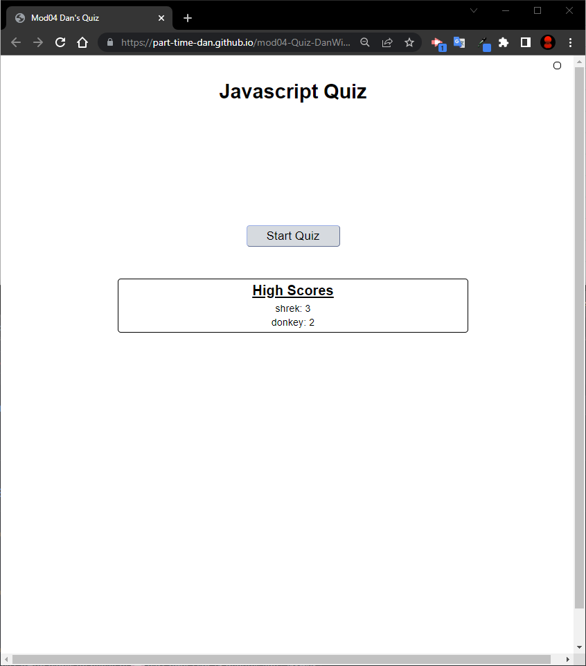

# mod04-Quiz-DanWilson

## Description
Module 04 challenge for bootcamp to create a quiz using Javascript that follows a specific set of criteria.

Objectives:

- Clicking a start button begins a countdown timer and presents a question
- Answering each question causes the next question to display
- Incorrect answers decrement time from the countdown
- When all questions are answered, the timer reaches 0
- Game over state with an input for initials and score

Addition Note: *Quiz questions are currently written as placeholders for the purpose of being able to test the criteria*

## Installation

N/A

## Usage

Visit the site here [Dan's Quiz](https://part-time-dan.github.io/mod04-Quiz-DanWilson/)

Click the "Start Quiz" button and use the in-game buttons. Answer questions and see user feedback for correct/incorrect conditions, an updating score counter and leaderboard using local storage. Try answering questions incorrectly to see the countdown deduct 5 seconds.

### Known Issues

Console line break when quiz ends. I am not sure if there is a clean way to end an array cycle.

## License

N/A

## Deploy Git Page Screenshot

